1) Open module-2/assignments/assignment.xml in your browser. Are there any errors? Explain the error and fix it.

Error in line11 : 
The element in the tag should not have any space in between the words (i.e. <effective-date>) or Date can have an attribute with some value i.e. (<date type="effective">03/12/2016</date>)
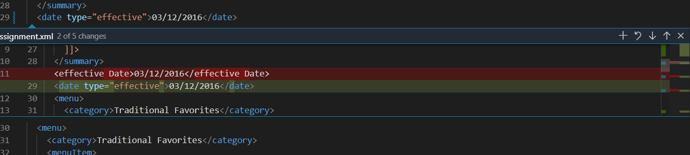
Error in line31,line51 : 
Elements in opening and closing tag must be an exact match.
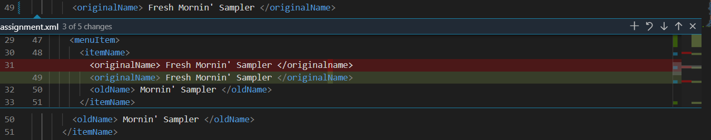
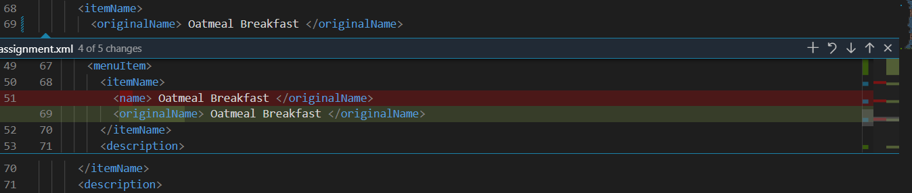

2)What is the use of CDATA block in this document?
Generally, CDATA section of XML is not interpreted as markup by the parser rather it is interpreted as character data. In this document, the summary content will be interpreted as characters. Plus CDATA helps us to avoid the use of character reference and entity reference.
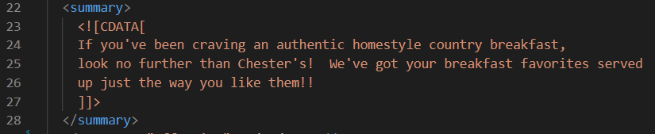

3) Add comment line to the end of file which contains you name and student id.

4)Identify prolog, document body, and epilog in the document. Are there any processing instructions?
    a)Prolog:
    line1: <?xml version="1.0" encoding="UTF-8" standalone="yes" ?>
    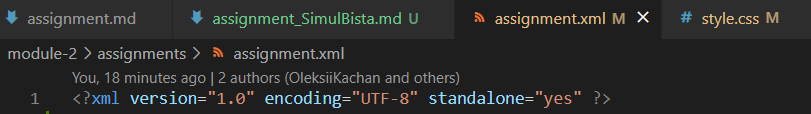
    b)Document body:
    line 20 - 100
    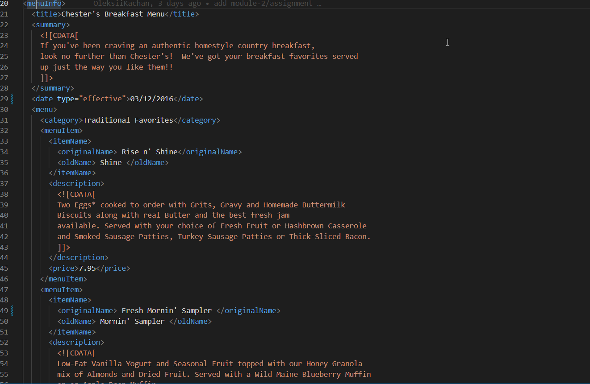
    c)Epilog:
    line 101: <!--Simul Bista (N01489966)-->
    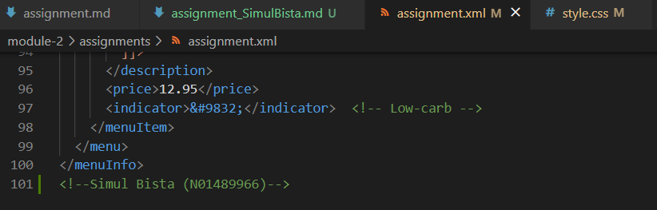

    There are no processing instructions but it was added later i.e.
    line2: <?xml-stylesheet type="text/css" href="../style.css" ?>
    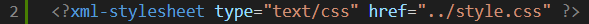

5)Add inline DTD for this document.
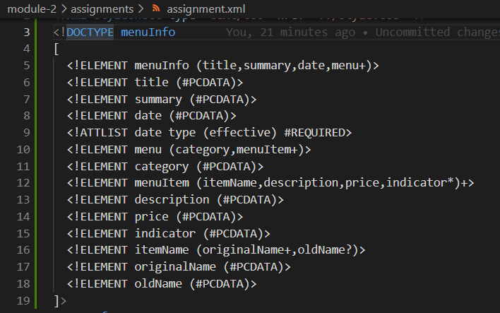

6)Verify that file is well-formed and valid.
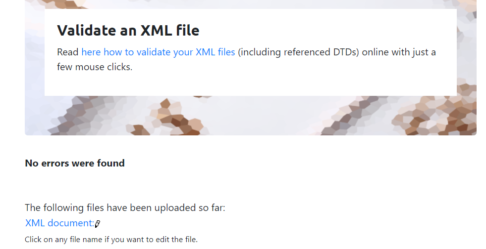

7. Create `style.css` file and link it to the file.

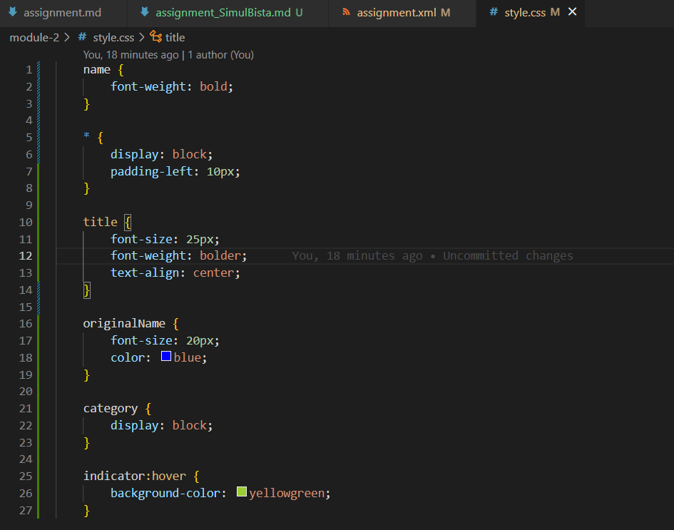

