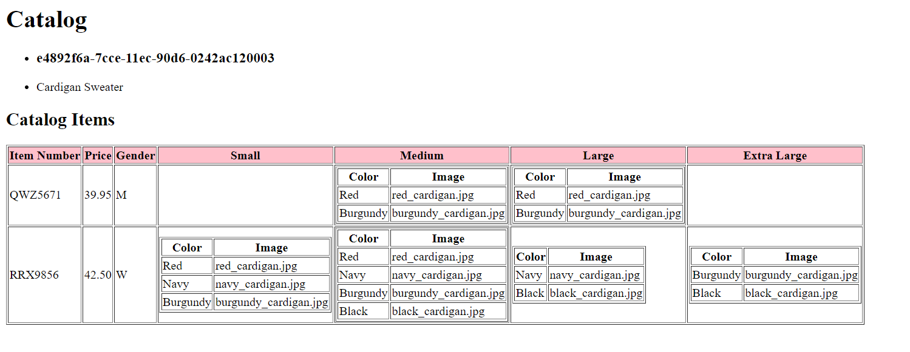
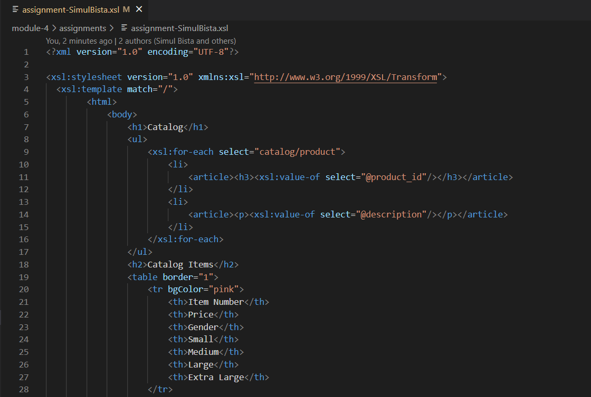
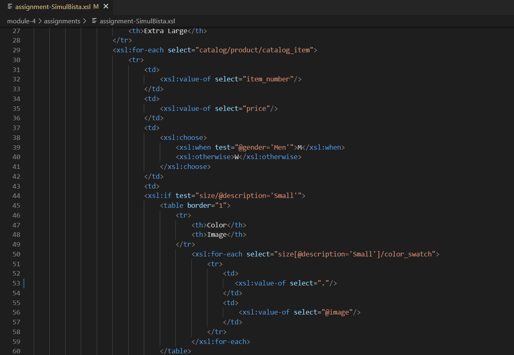

The following is the output. It has a list and a table which has a subtable inside some of its cell.

For each product in the catalog, the values in the attibutes: product_id and description are stored in an unordered list.
And then, catalog items are stored in a table.

For each catalog_item, all the elements such as item_number, price, gender and different sizes are displayed as fields in the table. xsl:choose is used for the gender logic. Also, xsl:if is used to display the subtable in a cell if it exists (otherwise it displays an empty cell). For each color_swatch, a subtable shows its elements: the color swatch (denoted by . which represents the current node) and then the value of the image attribute.

